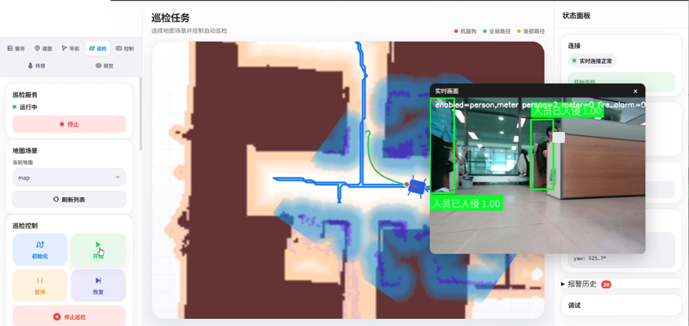
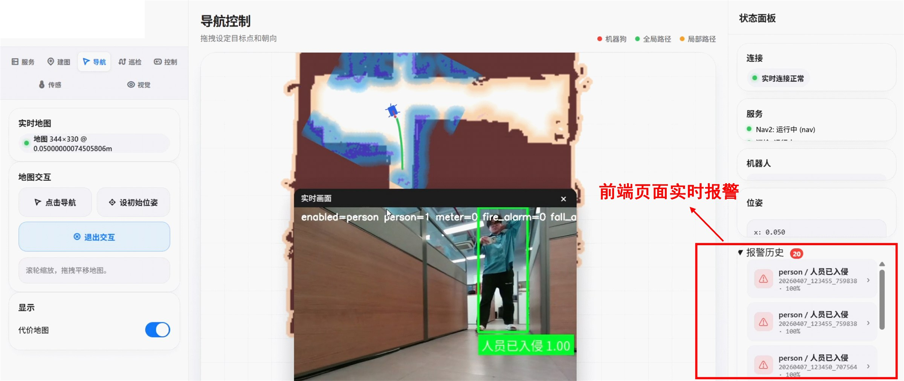
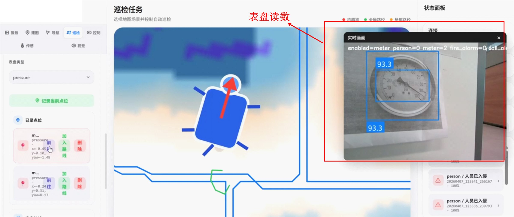
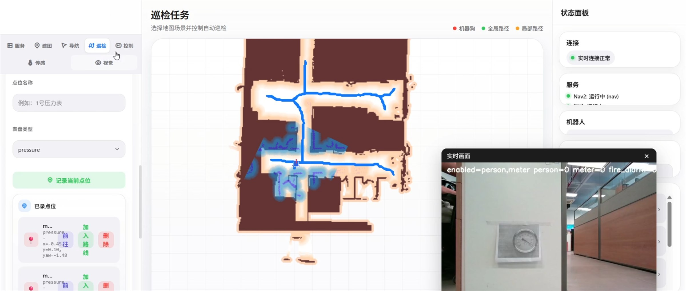

# GuardDog-Q CyberDog Inspection System

GuardDog-Q 是一套基于 CyberDog、Jetson Orin 和 ROS 2 的多模态四足机器人自主巡检系统。系统通过 Web 端下发建图、导航、巡检和视觉检测任务，由 Orin 负责任务调度、机器人导航、算法启停、异常判断与巡检数据管理。

系统支持 SLAM 建图与定位、预设点位巡检、动态避障、人员识别、表盘读数、环境传感器采集及前端告警追溯。

## 核心功能

- Web 端一键启动建图、导航、巡检和视觉检测服务。
- 基于 Cartographer、AMCL 和 Nav2 完成建图、定位与路径规划。
- CyberDog 自主移动、巡检任务暂停恢复及实时动态避障。
- 视觉算法按需启停，支持人员识别、表盘检测等巡检任务。
- 环境传感器与视觉检测并行运行，异常结果统一汇总。
- 告警截图、时间、点位、传感器数据和处置结果记录与查询。

## 实机演示

<table>
  <tr>
    <td align="center"><b>自主到达预设点位并读取表盘读数</b><br></td>
    <td align="center"><b>SLAM 建图、前端一键初始化与巡检任务执行</b><br></td>
  </tr>
  <tr>
    <td align="center" colspan="2"><b>实时避障功能演示</b><br></td>
  </tr>
</table>

## Web 端识别与告警

<p align="center">
  <b>人员识别与巡检地图联动界面</b><br>
  
</p>

<p align="center">
  <b>人员识别事件与前端告警记录</b><br>
  
</p>

<table>
  <tr>
    <td align="center"><b>表盘检测与读数结果</b><br></td>
    <td align="center"><b>地图、视频与巡检控制界面</b><br></td>
  </tr>
</table>

## 项目结构

```text
ros2_packages/
├─ cyberdog_web_bridge/       Web 控制、任务下发与状态推送
├─ cyberdog_inspection/       巡检任务执行与 Nav2 接入
├─ cyberdog_nav2_lidar/       建图、定位、导航与速度桥接
└─ sensor_data/               环境传感器数据采集

robot_vision/cyberdog_ai_pkg/
├─ scripts/                   视觉服务管理、检测结果聚合与告警
├─ launch/                    ROS 2 启动文件
├─ msg/                       检测结果消息
└─ srv/                       检测器动态启停服务
```

## 未上传内容

- `*.onnx`、`*.engine`、`*.pt`、`*.wts` 和 Paddle 模型。
- CyberDog、相机、雷达 SDK 及动态库。

轨迹优化与运动规划项目：[QIanKin/MOCHA](https://github.com/QIanKin/MOCHA)
